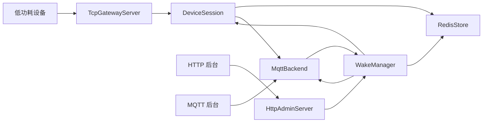

# lowpower-tcp-gateway 系统流程说明

本文档描述当前网关的核心运行流程，包括设备接入、状态同步、命令下发、MQTT 后台交互，以及面向大规模低功耗设备接入时的运行方式。

## 1. 系统定位

这个项目本质上是一个低功耗设备接入网关，位于设备和后台平台之间，承担以下职责：

- 管理设备 TCP 长连接。
- 自动识别设备协议类型。
- 完成登录或鉴权流程。
- 维护设备在线状态与心跳信息。
- 将设备状态同步到 Redis 和 MQTT。
- 接收后台命令并路由到对应设备。
- 跟踪命令的派发、确认、完成、失败与重试过程。

## 2. 运行组件

当前运行时主要由以下模块组成：

- AppConfig：读取 config.json 中的服务配置。
- TcpGatewayServer：监听设备 TCP 端口并接收连接。
- DeviceSession：管理单个设备连接、协议识别、读写和状态更新。
- HttpAdminServer：提供 HTTP 查询和命令下发接口。
- WakeManager：当前代码中的命令派发器，负责命令发送、重试、ACK 和完成态管理。
- RedisStore：持久化在线状态、设备密钥、待确认命令等数据。
- MqttBackend：和 MQTT 后台交互，接收后台命令请求并发布状态与事件。

## 3. 总体链路



## 4. 设备接入流程

### 4.1 连接建立

设备连接到 TCP 端口后，TcpGatewayServer 为每个连接创建一个 DeviceSession。

DeviceSession 启动后会先读取首包，用于自动识别协议：

- 如果首字节是 `{`，按 JSON Line 协议处理。
- 如果首字节是低功耗二进制协议版本号，按低功耗协议处理。
- 如果都不匹配，直接关闭连接。

### 4.2 JSON 设备流程

JSON 设备的典型流程如下：

1. 建立 TCP 连接。
2. 发送 login 消息。
3. 网关保存设备在线状态。
4. 网关返回 login_ack。
5. 设备周期性发送 heartbeat。
6. 网关更新在线状态并返回 heartbeat_ack。
7. 设备接收后台命令，回传 wake_ack 或 task_done。

### 4.3 低功耗协议设备流程

低功耗设备的典型流程如下：

1. 建立 TCP 连接。
2. 发送鉴权请求帧。
3. 网关解析 LV 结构的 payload。
4. 根据加密设备标识从 Redis 找到设备 ID。
5. 使用 local_key 解密并校验签名。
6. 鉴权成功后注册设备在线状态。
7. 返回鉴权响应帧。
8. 设备发送心跳帧。
9. 网关刷新在线状态并返回心跳响应。
10. 后台需要唤醒时，网关向设备发送低功耗唤醒帧。

## 5. 在线状态同步流程

每当设备登录、心跳、状态变化或断开连接时，网关会同步状态到两个后端：

- Redis：用于状态查询、索引和命令状态缓存。
- MQTT：用于后台事件订阅和异步联动。

### 5.1 Redis 中的典型数据

- device:online:{device_id}：在线状态。
- device:pending_wake:{device_id}:{msg_id}：待确认命令。
- device:local_key:{device_id}：设备本地密钥。
- lowpower:device_id_index:{encrypted_device_id_b64}：加密设备 ID 到真实设备 ID 的映射。

### 5.2 MQTT 中的典型主题

- lp_gateway/devices/{device_id}/state：设备状态。
- lp_gateway/devices/{device_id}/commands/request：后台命令请求。
- lp_gateway/devices/{device_id}/commands/events：命令事件流。

## 6. 后台命令下发流程

### 6.1 HTTP 命令链路

HTTP 后台可通过以下接口下发命令：

```http
POST /api/devices/{device_id}/commands?cmd=take_photo
```

兼容入口：

```http
POST /api/devices/{device_id}/wake?cmd=take_photo
```

执行流程如下：

1. 后台请求 HttpAdminServer。
2. HttpAdminServer 调用 WakeManager。
3. WakeManager 查找目标设备会话。
4. 根据设备协议生成 JSON 命令或低功耗唤醒帧。
5. 记录 pending 命令到 Redis。
6. 向设备发送命令。
7. 发布 MQTT 命令事件，状态为 dispatched。

### 6.2 MQTT 命令链路

MQTT 后台可向以下主题发布命令请求：

```text
lp_gateway/devices/{device_id}/commands/request
```

消息体示例：

```json
{
  "cmd": "take_photo",
  "params": {
    "resolution": "640x480",
    "quality": 80
  }
}
```

执行流程如下：

1. MqttBackend 订阅命令请求主题。
2. 收到后台命令后解析 device_id 和 JSON payload。
3. 将命令投递到主 io_context 线程池。
4. 调用 WakeManager 执行实际命令派发。
5. 命令派发结果和后续状态变化会发布到 commands/events 主题。

## 7. 命令生命周期

当前命令事件会覆盖以下状态：

- dispatched：命令已下发到设备。
- retrying：命令超时后重试。
- acked：设备已确认收到命令。
- done：设备执行完成。
- failed：达到最大重试次数仍未成功。
- rejected：后台请求无效或网关暂时无法派发。

### 7.1 命令事件示例

```json
{
  "device_id": "dev001",
  "msg_id": "W1715700000000",
  "status": "acked",
  "cmd": "take_photo"
}
```

## 8. 大规模设备接入处理方式

当前代码已经具备适合承载大量低功耗设备的几个基础点：

- 基于 Asio 的事件驱动网络模型。
- io_context 多线程运行，可通过 server.worker_threads 配置工作线程数。
- 每个连接使用串行写队列，避免并发写 socket 导致乱序或重入。
- 心跳和命令处理以异步方式执行，不依赖每连接一个线程。
- Redis 作为状态和待确认命令的共享存储。
- MQTT 作为后台异步事件总线，避免后台和网关之间强耦合。

对于几万台低功耗设备，建议按下面思路使用：

### 8.1 线程模型

- 根据 CPU 核数配置 server.worker_threads。
- 避免在网络线程中执行长时间阻塞逻辑。
- Redis 和 MQTT 操作后续可继续演进为专用异步队列。

### 8.2 连接特征

- 低功耗设备连接数量可以很大，但单设备流量通常很低。
- 关键不是每秒带宽，而是连接数、心跳分布和状态同步频率。
- 应控制心跳周期，避免所有设备同一时间点集中上报。

### 8.3 后台交互方式

- 后台状态消费优先走 MQTT 订阅。
- 强查询走 HTTP 或 Redis。
- 大量命令下发优先走 MQTT，请求和事件天然解耦。

### 8.4 后续优化方向

如果设备规模继续扩大，下一阶段建议优化：

- Redis 写操作改为批量异步写入。
- MQTT 发布改为内部无锁或分片队列。
- 按设备 ID 分片部署多个网关实例。
- 为命令事件引入更明确的 trace_id 和幂等键。
- 增加端到端压测与心跳洪峰测试。

## 9. 部署方式

当前仓库默认通过 Docker Compose 运行，依赖包括：

- Redis
- MQTT Broker
- Gateway

默认启动命令：

```bash
docker compose up -d --build
```

## 10. 关键配置项

```json
{
  "server": {
    "tcp_port": 9000,
    "http_port": 8080,
    "heartbeat_default_sec": 180,
    "idle_timeout_sec": 600,
    "worker_threads": 4
  },
  "mqtt": {
    "enable": true,
    "host": "mqtt",
    "port": 1883,
    "topic_prefix": "lp_gateway",
    "command_request_topic": "devices/+/commands/request"
  }
}
```

说明：

- 如果使用 Docker Compose，mqtt 和 redis 主机名可以直接使用服务名。
- 如果直接在宿主机运行二进制，通常需要把 mqtt.host 和 redis.host 改为 127.0.0.1 或实际地址。

## 11. 当前代码中的角色命名说明

虽然代码里仍然保留 WakeManager 这个类名，但它在当前系统中的职责已经不只是“唤醒”，更接近一个命令派发器，负责：

- 后台命令路由。
- 设备协议适配。
- 命令重试与超时管理。
- 命令生命周期事件发布。

因此在业务理解上，建议把 WakeManager 看作“命令分发层”，而不是单一的“唤醒模块”。